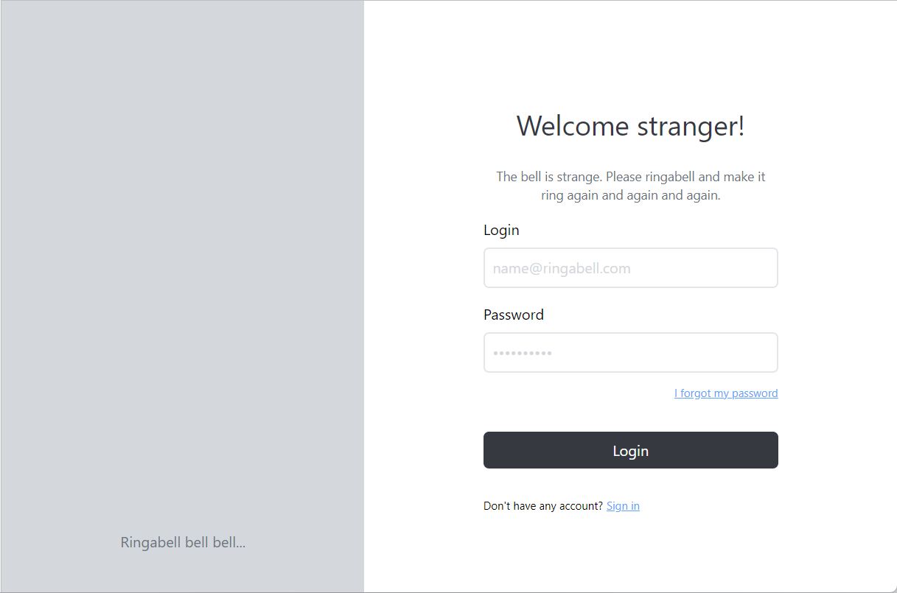
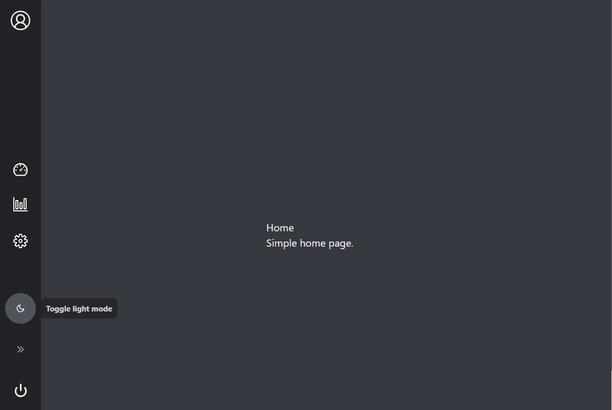

# Ringabelle

## Simple React App using TS, TailwindCSS, React-Routes, React-i18n

  

Ringabelle is a tiny tiny dashboard made with React.

  

## Features

  

- Translation with react-i18next

- Styling with TailwindCSS

- Light and dark mode theme

- Routes with react-router-dom

- all in Typescript

  





  

## Installation

  

Install the dependencies and devDependencies and start the server.

  

```sh

npm install

npm start

```

## Credits

Without them, this app wouldn't exist, big thanks to:

 - [How to start a react app from scratch (without **Create React App**) by Meg Shulmister](https://medium.com/@megshulmister?source=post_page-----8e9948602e9c--------------------------------)
 - [Full course to learn React by Maximilian Schwarzmüller](https://www.udemy.com/user/academind/)
 - Use TailwindCSS: https://github.com/fireship-io/tailwind-dashboard
