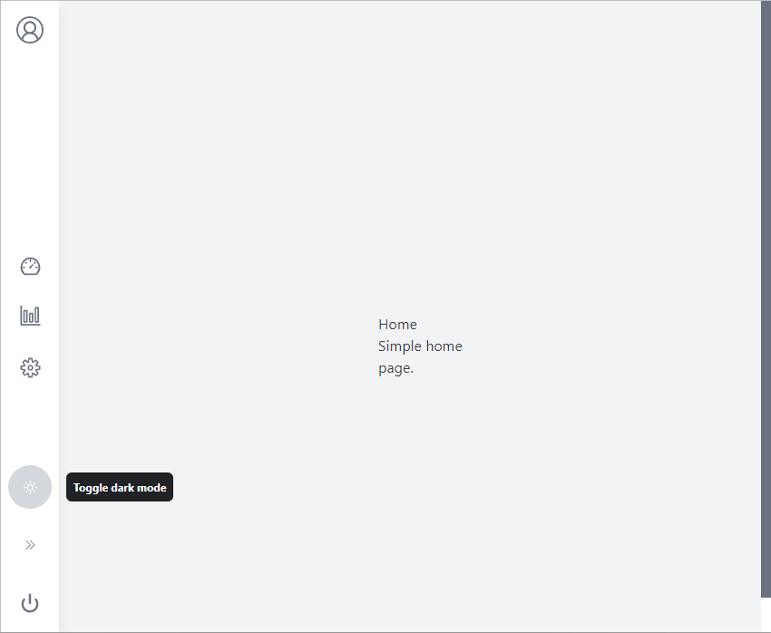

# Ringabelle
## Simple React App using TS, TailwindCSS, React-Routes, React-i18n

Ringabelle is a tiny tiny dashboard made with React.

## Features

- Translation with react-i18next
- Styling with TailwindCSS
- Routes with react-router-dom
- all in Typescript



## Installation

Install the dependencies and devDependencies and start the server.

```sh
npm install
npm start
```